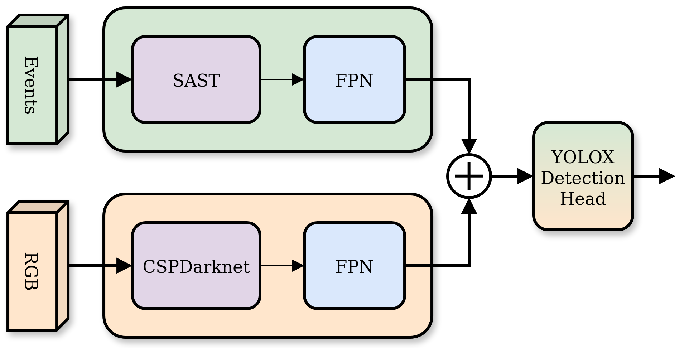
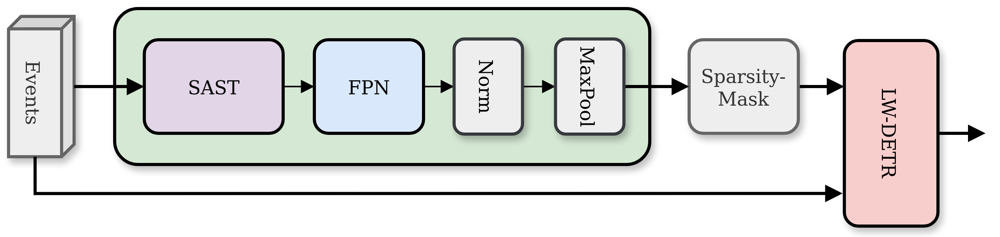
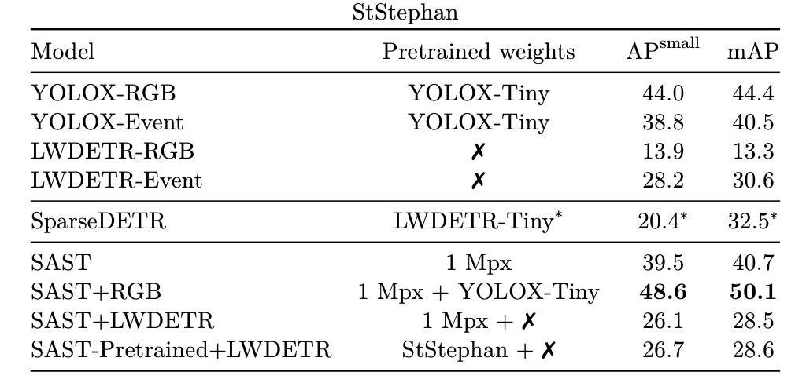

This is a modified copy of [SAST](https://github.com/Peterande/SAST). It includes different model architectures making use of a modified SAST architecture. 

# Adopted SAST to support Multimodal input of RGB and Event data
<p align="center">
  
</p>


## Conda Installation
```Bash
./setup_env.sh
conda activate sast
```
Detectron2 is not strictly required but speeds up the evaluation.

## Used datasets for training and evaluation
- [NeRDD](https://github.com/MagriniGabriele/NeRDD)
- [F-UAV-D](https://arxiv.org/abs/2403.11875)


You may also pre-process the dataset yourself by following the [instructions](preprocessing/README.md).

## Pre-trained Checkpoints

We used the following checkpoints from the respective model repositories

| YOLOX  | SAST | LWDETR |
|--------|-------|-------|
|[YOLOX-s](https://github.com/Megvii-BaseDetection/YOLOX?tab=readme-ov-file)|[1 Mpx](https://github.com/Peterande/SAST)|[LWDETR_tiny_30e_objects365](https://github.com/Atten4Vis/LW-DETR) |

## Training
- Set `DATA_DIR` in [set_envs.sh](set_envs.sh)
- Set other parameters as well for example GPUS=0 or GPUS=[0,1]
- run:
```bash
source set_envs.sh
```
### NeRDD and F-UAV-D
To run models with both event and rgb data select the dataset=eventrgb type and specify the DATA_DIR to the preprocessed data.
Check the config folder to set pretrained checkpoints
```Bash
python train.py model=rnndet dataset=eventrgb dataset.path=${DATA_DIR} wandb.project_name=SAST 
wandb.group_name=1mpx hardware.num_workers.train=2 batch_size.train=${BATCH_SIZE_PER_GPU} 
hardware.num_workers.eval=2 batch_size.eval=${BATCH_SIZE_PER_GPU} 
hardware.gpus=[${GPUS}] +experiment/gen4="base.yaml" 
training.learning_rate=${lr} validation.val_check_interval=10000
```
## Models that can be selected
The model= parameter can be one of those:
- rnndet
- lwdetr
- rgb
- eventrgb

rnndet is the base SAST model and rgb is a base yolox model. SAST expects only event data while rgb expects RGB images.
Both models work with dataset=eventrgb

### lwdetr architekture
Using SAST as a model to create sparsified masks:
<p align="center">
  
</p>

### eventrgb
- needs both modalities RGB and event data

# Model performance
<p align="center">
  
</p>

StStephan is a subset of the F-UAV-D dataset

The table names map to the model parameter like this:
- SAST = rnndet
- YOLOX-RGB = rgb
- SAST+RGB = eventrgb
- SAST+LWDETR = lwdetr
- SAST-Pretrained+LWDETR = lwdetr (checkpoint from training SAST on StStephan)

## Example

```bash
python train.py model=eventrgb dataset=eventrgb dataset.path="${DATA_DIR_NERD}" wandb.project_name=NERD_NEW wandb.group_name=rgb batch_size.train=4 batch_size.eval=4 hardware.gpus=\[${GPUS}\] +experiment/arma="base.yaml" training.learning_rate=${lr} dataset.train.use_fraction=1 dataset.validation.use_fraction=1
```

```bash
python train.py model=rgb dataset=eventrgb dataset.path="${DATA_DIR_NERD}" wandb.project_name=NERD_NEW wandb.group_name=rgb batch_size.train=4 batch_size.eval=4 hardware.gpus=\[${GPUS}\] +experiment/arma="base.yaml" training.learning_rate=${lr} dataset.train.use_fraction=1 dataset.validation.use_fraction=1 fpn.ckpt=yolox_s.pth
```

## Code Acknowledgments
This project has used code from the following projects:
- [SAST](https://github.com/Peterande/SAST) for the SAST architecture
- [RVT](https://github.com/uzh-rpg/RVT) for the RVT architecture implementation in Pytorch
- [timm](https://github.com/huggingface/pytorch-image-models) for the original MaxViT layer implementation in Pytorch
- [YOLOX](https://github.com/Megvii-BaseDetection/YOLOX) for the detection PAFPN/head
